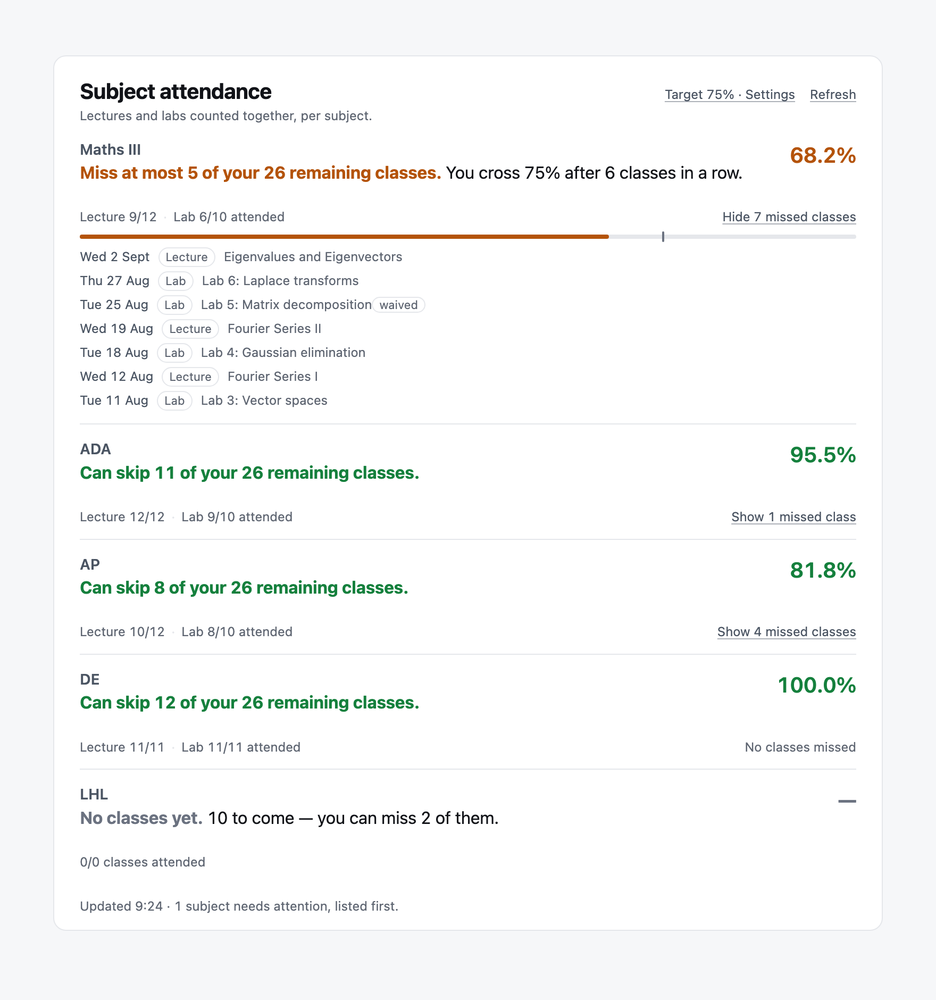
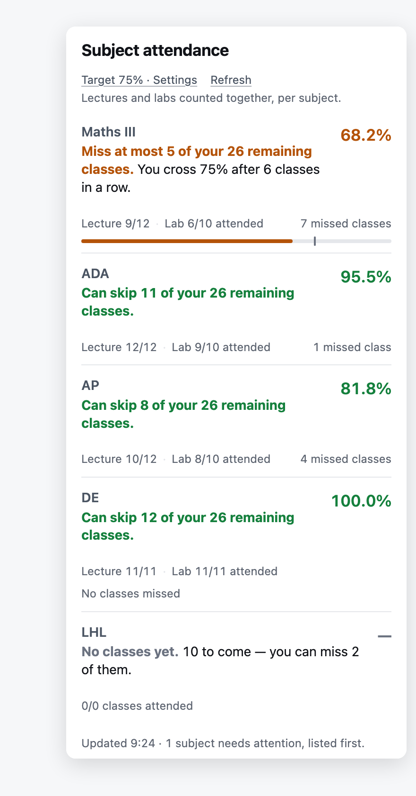
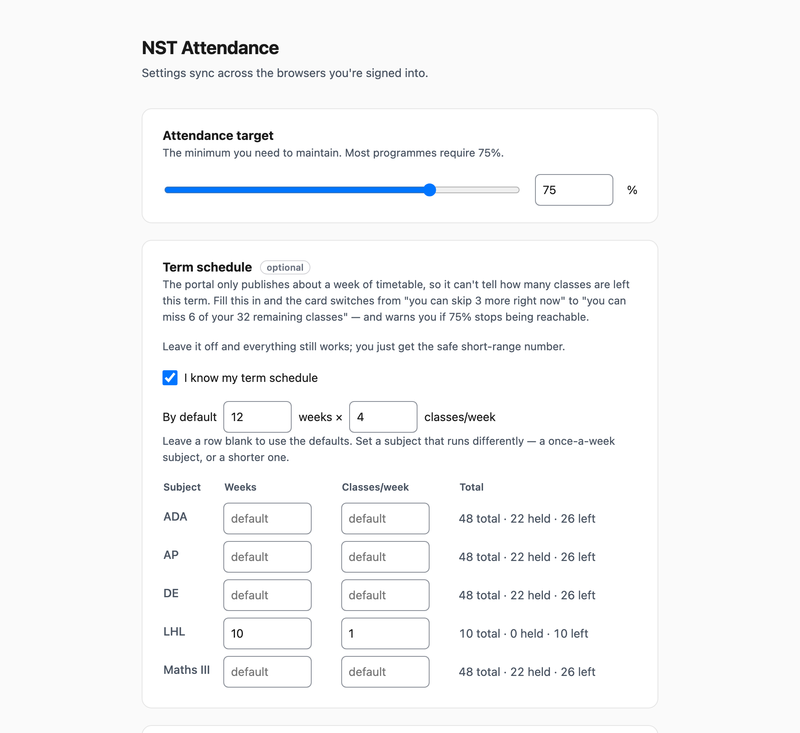
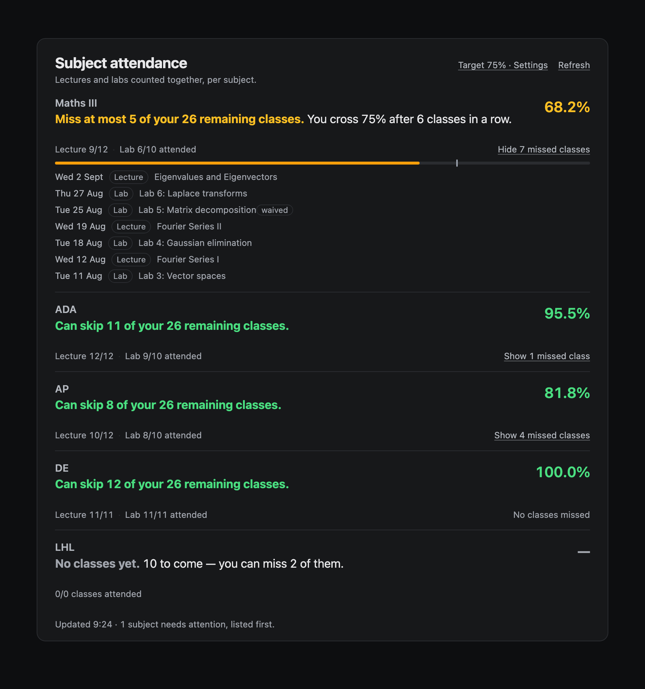

# NST Attendance

A Chrome extension for students on the Newton School portal (`my.newtonschool.co`).

The portal lists a subject and its lab as two separate courses — `ADA - B` and `ADA Lab 2 - B` — so
you can see each figure but never the one that actually decides your eligibility: the **combined**
attendance across both. This works it out, and then answers the question you actually have:

> **How many more classes can I skip and still hold 75%?**

And when you're already below the line, how many you need to attend in a row to climb back.

Everything runs locally in your browser against your own logged-in session. No backend, no
analytics, nothing leaves your machine. See [PRIVACY.md](PRIVACY.md).



## Install

Not on the Chrome Web Store yet, so load it unpacked:

1. **Download the code** — [click here for a ZIP](https://github.com/yats0x7/nst-attendance/archive/refs/heads/main.zip), then unzip it. (Or `git clone https://github.com/yats0x7/nst-attendance.git`.)
2. Open **`chrome://extensions`** in Chrome.
3. Turn on **Developer mode** — the switch is in the top right.
4. Click **Load unpacked** and select the `nst-attendance` folder (the one with `manifest.json` in it).
5. Open any course page on the portal. The card appears under **"Your performance"**.

If you change anything in the code, press the circular **reload** arrow on the extension's card in
`chrome://extensions`, then reload the portal tab.

## How to use it

**Just read the sentence.** Each subject gets one line telling you what to do. The percentage next
to it is the evidence, not the point. Subjects that need attention are pushed to the top.

**Click "Show N missed classes"** on any subject to see exactly which ones you missed, with dates
and whether it was a lecture or a lab.

**The toolbar icon** shows the same numbers from cache, wherever you are, and puts a red badge on
itself when a subject drops below your target.



### Optional: tell it your term schedule

By default the card answers *"how many classes can I miss right now and stay above 75%"*. That is
exact and needs no setup, but it can't see past today.

Open **Settings** (the link in the card header, or right-click the toolbar icon → Options) and tick
**"I know my term schedule"**. Enter how many weeks your term runs and how many classes a week each
subject has. The card then switches to the number that's actually useful:

> Miss at most **5** of your **26** remaining classes.



Most subjects share the same default (12 weeks × 4 classes). Fill in a row only for a subject that
runs differently — a once-a-week subject, or a shorter one. The "22 held · 26 left" readout next to
each row tells you straight away if a default is wrong for that subject.

**One warning.** This is only as good as the number you give it. **Overstating the term length
overstates how much you can skip**, and that error lands in the direction that hurts you. If the
term runs past what you entered, the card says so and falls back to the safe figure rather than
declaring subjects lost.

### Dark mode

Follows your system theme, everywhere.



## How the numbers work

Attendance is rolled up by summing **raw class counts** across a subject's components, not by
averaging their percentages. Those two only agree when theory and lab have held the same number of
classes — 100% over 2 labs and 50% over 30 lectures averages to a comfortable-looking 75% when the
real figure is 53%.

With `a` attended, `h` held, and target `t`:

| Question | Answer |
|---|---|
| Where am I? | `a / h` |
| How many can I skip? | `⌊a/t⌋ − h` |
| How many must I attend to recover? | `⌈(t·h − a) / (1 − t)⌉` |
| With `r` classes still scheduled, how many of those can I skip? | `⌊a + r − t·(h + r)⌋` |
| Is the target still reachable? | `(a + r) / (h + r) ≥ t` |

The short-range figure is a floor, never a forecast: it can't overstate, and it regenerates — attend
a class and the allowance goes up.

**If it can't read real numbers it shows none.** No estimates, no filling in blanks. A wrong figure
here is what makes someone skip a class they couldn't afford.

## Subjects in other batches

Different batches name the practical component differently. The pairing recognises Lab, Practical,
Prac, Tutorial, Tut, Workshop, Recitation, Seminar, Studio and Discussion, numbered or not, and only
at the *end* of a name — so "Lab Techniques" stays a subject, not a lab.

Breadth alone would be unsafe, so a marker is only stripped when the result matches another course
in the same semester:

- `ADA Lab 2 - B` + `ADA - B` → one subject, because `ADA` exists.
- `Chem Lab 1 - A` + `Chem Lab 2 - A` → one subject, because they reduce to the same base.
- `AI Studio - B` on its own → stays `AI Studio`. It will not invent a subject that isn't there.

A subject with no lab is simply a group of one. Nothing is hardcoded to one batch: course hashes
come from the URL, the semester is resolved through the API, and the subject list is whatever that
semester returns. If a naming scheme still defeats it, **Settings → Subject grouping** can map any
course onto any subject by hand, or force apart two it merged.

## Built to be light on the portal

Thousands of students hitting the portal at nine in the morning is the case this is designed for:

- The subject list and course→semester mapping are cached for 12 hours; only the per-subject counts
  are refetched, and only when the 10-minute cache is stale or you press Refresh.
- Numbers are cached **per semester**, so clicking between nine subject pages costs zero requests.
- At most 4 requests in flight; retries back off with jitter and honour `Retry-After`; auth and
  client errors are never retried.
- Refresh has a 10-second cooldown, and concurrent triggers share one request.
- Cached numbers older than 24 hours are not shown at all.

## Privacy and permissions

- Permissions: `storage`, plus host access to `https://my.newtonschool.co/*` and nothing else.
  No `tabs` permission.
- Your portal login token is read in exactly one function and can only be sent to a same-origin
  `/api/vN/` path. Course hashes are validated before they touch a URL, and redirects are not
  followed.
- Strict CSP on extension pages. No third-party code and no dependencies at all.
- Everything rendered from portal data is HTML-escaped, and the card lives in a Shadow DOM so it
  can't collide with the page.

## Accessibility

Every text pair clears 4.5:1 in both light and dark. Controls are at least 24px, keyboard focus is
visible and survives re-renders, `prefers-reduced-motion` is respected, loading and error states are
announced to screen readers, and every input is labelled. Colour is never the only signal — every
state has a sentence.

## Development

No build step and no dependencies.

```bash
npm test          # 96 tests, node --test
npm run package   # dist/nst-attendance-<version>.zip
```

The tests include an exhaustive sweep over every attended/held pair up to 60 classes, asserting the
reported skip count is both affordable and maximal, and the recovery count both sufficient and
minimal.

To look at the UI without a portal session:

```bash
python3 dev/serve.py 8731 .
```

- `dev/preview.html` — the card in every state
- `dev/popup-preview.html` — the toolbar popup
- `dev/options-preview.html` — settings
- `dev/shots/shot.html` — the fixtures the screenshots above are captured from

`dev/serve.py` is used instead of `python3 -m http.server` because the latter honours conditional
requests, which lets a stale module keep rendering while you're checking a change.

## Layout

```
manifest.json            MV3
icons/
src/
  background.js          service worker: toolbar badge, opens settings
  content/
    mount.js             lifecycle, caching, anchoring, SPA navigation
    panel.js             the card (Shadow DOM); pure render from state
  popup/                 toolbar popup — same card, from cache
  options/               target %, term schedule, grouping overrides
  lib/
    math.js              attendance arithmetic (pure)
    grouping.js          subject ↔ lab pairing (pure)
    schedule.js          term length → classes remaining (pure)
    portal.js            fetch orchestration, caches, scoring
    storage.js           settings (sync) + caches (local)
    adapters/api-adapter.js   the portal's REST endpoints; the only fetch
test/                    node --test
dev/                     local harnesses; not shipped
docs/portal-api.md       the portal endpoints this uses, and how they were confirmed
PRODUCT.md, DESIGN.md    who this is for, and the visual system it is built on
```

## Notes

The screenshots and dev fixtures use a made-up semester, not anyone's real attendance. The portal
endpoints are undocumented and could change without warning — `api-adapter.js` fails loudly rather
than defaulting missing fields to zero, so if the portal changes you get "no numbers" and a message,
never a confident wrong answer.

## Licence

MIT — see [LICENSE](LICENSE).
